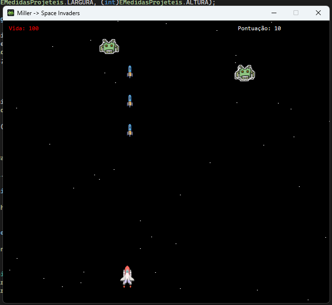

# 🚀 Primeiro Jogo [Miller Space Invaders]

Um jogo clássico de Space Invaders desenvolvido em C# com Windows Forms, apresentando mecânicas modernas e gráficos personalizáveis.

[](https://docs.microsoft.com/en-us/dotnet/csharp/)
[](https://dotnet.microsoft.com/)
[](https://docs.microsoft.com/en-us/dotnet/desktop/winforms/)
[](LICENSE)

## 📸 Screenshots

<!-- Adicione suas capturas de tela aqui -->


*Tela principal do jogo em ação*


## 🎮 Sobre o Jogo

Miller Space Invaders é uma reimaginação moderna do clássico arcade Space Invaders. O jogador controla uma nave espacial e deve defender a Terra de ondas intermináveis de invasores alienígenas, coletando pontos e sobrevivendo o máximo possível.

### ✨ Características

- **🎯 Jogabilidade Clássica**: Movimento fluido e controles responsivos
- **👾 Sistema de Inimigos**: Spawn aleatório de inimigos com IA básica
- **💥 Sistema de Combate**: Projéteis com detecção de colisão precisa
- **❤️ Sistema de Vida**: Múltiplas vidas com feedback visual
- **🏆 Sistema de Pontuação**: Pontuação crescente baseada em inimigos eliminados
- **🎨 Gráficos Personalizáveis**: Suporte para sprites PNG customizados
- **🌌 Backgrounds Dinâmicos**: Múltiplas opções de fundo (sólido, gradiente, imagem, estrelas)
- **⚡ Performance Otimizada**: Double buffering para renderização suave

## 🕹️ Como Jogar

### Controles
- **A-S-D-W**: Mover a nave para esquerda/baixo/direita/cima
- **Enter**: Disparar projéteis
- **Enter (Game Over)**: Reiniciar o jogo

### Objetivo
- Elimine o máximo de inimigos possível
- Evite ser atingido pelos invasores
- Acumule pontos para bater seu recorde pessoal

## 🛠️ Tecnologias Utilizadas

- **Linguagem**: C# (.NET Framework/Core)
- **Interface**: Windows Forms
- **Gráficos**: System.Drawing (GDI+)
- **Arquitetura**: Orientação a Objetos com padrões de design
- **Performance**: Double Buffering, Timer-based game loop

## 📁 Estrutura do Projeto

```
MillerSpaceInvaders/
├── Enumeradores/          # Enums para configurações do jogo
├── Inimigos/             # Classes dos inimigos
├── Mecanicas/            # Lógica de movimento e projéteis
├── Render/               # Sistema de renderização
├── Util/                 # Utilitários e mensagens
├── Resources/            # Sprites e assets
├── Form1.cs              # Formulário principal
└── Program.cs            # Ponto de entrada
```

## 🚀 Como Executar

### Pré-requisitos
- Visual Studio 2019 ou superior
- .NET Framework 4.7.2 ou .NET 5/6/7
- Windows 10/11

### Instalação
1. Clone o repositório:
```bash
git clone https://github.com/xX-Mill3r-Xx/GameEngine
```

2. Abra o projeto no Visual Studio:
```bash
cd miller-space-invaders
start MillerSpaceInvaders.sln
```

3. Compile e execute:
   - Pressione `F5` ou clique em "Start"
   - Ou use `Ctrl+F5` para executar sem debug

### Build para Distribuição
```bash
dotnet publish -c Release -r win-x64 --self-contained
```

## 🎨 Personalizando Gráficos

O jogo suporta sprites PNG customizados. Para personalizar:

1. **Adicione suas imagens** à pasta Resources:
   - `player.png` - Sprite da nave do jogador
   - `enemy.png` - Sprite dos inimigos
   - `bullet.png` - Sprite dos projéteis
   - `background.png` - Imagem de fundo (opcional)

2. **Configure no código**:
```csharp
// Em PropiedadesDetela.cs
_playerImage = Properties.Resources.player;
_inimigoImage = Properties.Resources.enemy;
_projetilImage = Properties.Resources.bullet;
```

3. **Tamanhos recomendados**:
   - Player/Inimigos: 32x32 ou 64x64 pixels
   - Projéteis: 16x16 ou 8x24 pixels
   - Background: Resolução da tela do jogo

## 🔧 Configurações Avançadas

### Ajustar Dificuldade
```csharp
// Em Form1.cs - método tTemporizador_Tick
if(_rndSpawnInimigos.Next(0,100) < 5) // Altere o valor 5 para maior/menor spawn rate
    SpawnarInimigos();
```

### Modificar Velocidade do Jogo
```csharp
// Em Form1.cs - construtor
tTemporizador.Interval = 16; // ~60 FPS (16ms)
// Valores menores = mais rápido, maiores = mais lento
```

### Personalizar Sistema de Vidas
```csharp
// Na classe MovimentacaoPlayer
_movimento.ReceberHit(10); // Altere o valor do dano
```

## 🐛 Solução de Problemas

### Jogo está travando/com lag
- Verifique se o Double Buffering está habilitado
- Reduza o tamanho das imagens PNG
- Aumente o intervalo do timer

### Imagens não aparecem
- Verifique se as imagens estão nos Resources
- Confirme os nomes das imagens no código
- Teste com fallback (retângulos coloridos)

### Controles não respondem
- Certifique que `KeyPreview = true` no Form
- Verifique se os eventos KeyDown/KeyUp estão conectados

## 🤝 Contribuindo

Contribuições são bem-vindas! Para contribuir:

1. Fork o projeto
2. Crie uma branch para sua feature (`git checkout -b feature/AmazingFeature`)
3. Commit suas mudanças (`git commit -m 'Add some AmazingFeature'`)
4. Push para a branch (`git push origin feature/AmazingFeature`)
5. Abra um Pull Request

### 💡 Ideias para Contribuições
- [ ] Power-ups (tiro duplo, escudo, etc.)
- [ ] Diferentes tipos de inimigos
- [ ] Sistema de levels/ondas
- [ ] Efeitos sonoros
- [ ] Menu principal
- [ ] Sistema de high scores
- [ ] Multiplayer local
- [ ] Animações de sprites

## 📝 Changelog

### v1.0.0 (Em Desenvolvimento)
- ✅ Sistema básico de movimento e tiro
- ✅ Spawn de inimigos aleatório
- ✅ Detecção de colisão
- ✅ Sistema de pontuação
- ✅ Suporte para sprites PNG
- ✅ Múltiplas opções de background
- 🔄 Sistema de menu (em andamento)
- 🔄 Efeitos sonoros (planejado)

## 👨‍💻 Autor

**[Miller M.]**
- GitHub: [@xX-Mill3r-Xx]([https://github.com/SEU_USUARIO](https://github.com/xX-Mill3r-Xx))
- LinkedIn: [Miller M. Vasco]([https://linkedin.com/in/seu-perfil](https://www.linkedin.com/in/miller-martins-95bab5310/))
- Email: millermartinsvasco1@gmail.com

## 🙏 Agradecimentos

- Inspirado no clássico Space Invaders (1978)
- Comunidade C# e Windows Forms
- [Recursos/Tutoriais que você usou]

## 📊 Status do Projeto


---

⭐ Se você gostou do projeto, considere dar uma estrela no repositório!

---

*"Defenda a Terra, um invasor por vez!" 🌍👾*
